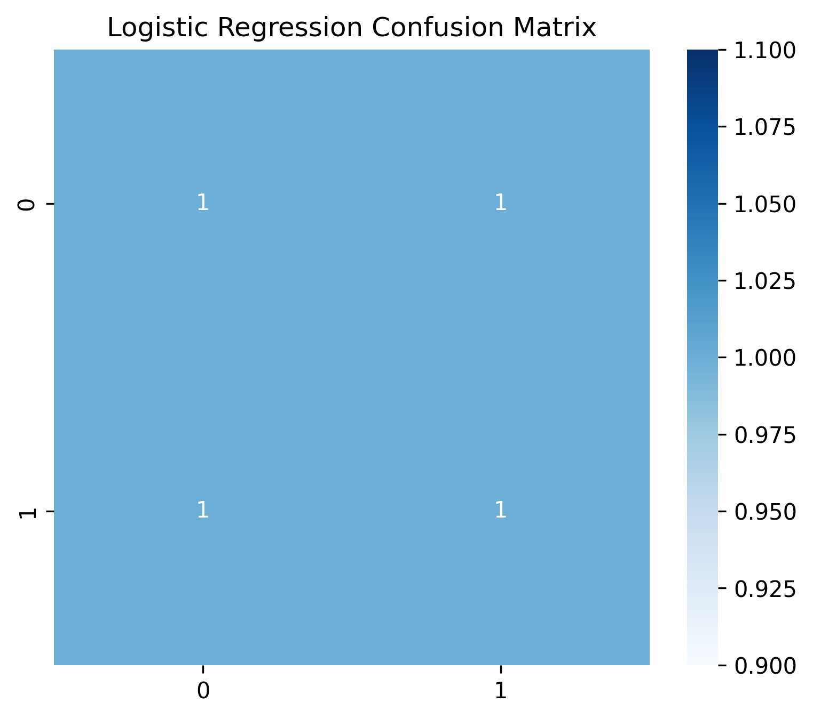
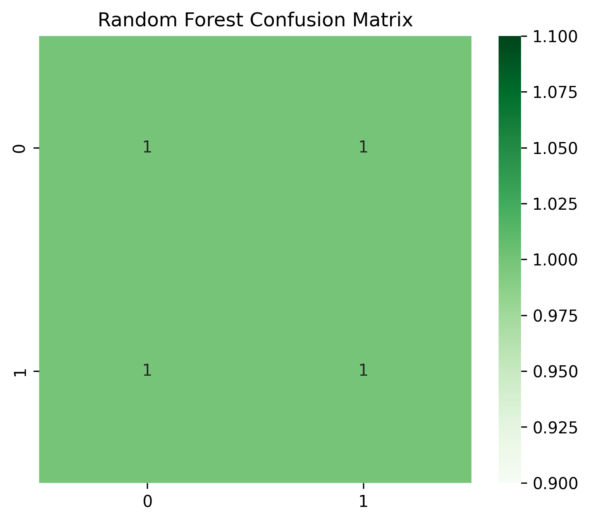
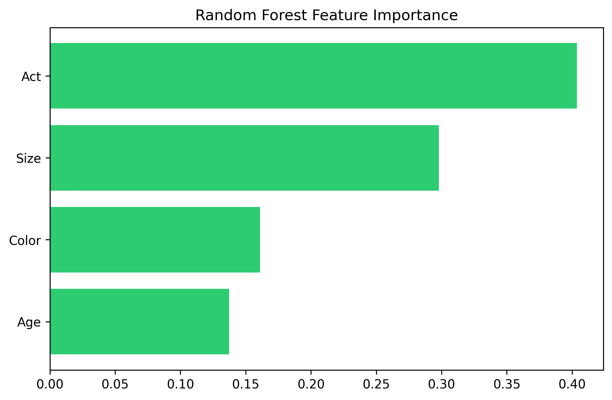
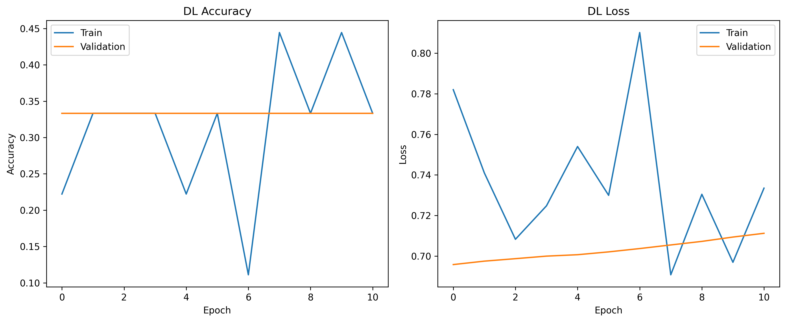

# 📘 Judul Proyek
*Analisis Prediksi Inflated Balloon Menggunakan Machine Learning*

## 👤 Informasi
- **Nama:** Imam Ramadhani
- **Repo:** [ https://github.com/ramadhanizx/UTS--DataScience.git  ](https://github.com/ramadhanizx/UTS--DataScience.git)
- **Video:** [https://youtu.be/-53fj0S8Uhs](https://youtu.be/-53fj0S8Uhs)  

---

# 1. 🎯 Ringkasan Proyek
- Menyelesaikan permasalahan prediksi apakah balon akan mengembang (`Inflated`)  
- Melakukan data preparation: cleaning, encoding, scaling, train-test split  
- Membangun 3 model: **Logistic Regression (Baseline)**, **Random Forest (Advanced ML)**, **Deep Learning (MLP)**  
- Melakukan evaluasi menggunakan Accuracy, Precision, Recall, F1-Score, Confusion Matrix  
- Menentukan model terbaik dan memberikan insight dari dataset  

---

# 2. 📄 Problem & Goals
**Problem Statements:**  
- Prediksi apakah balon akan mengembang berdasarkan fitur `Color`, `Size`, `Act`, dan `Age`  
- Menentukan model terbaik untuk klasifikasi biner dari dataset tabular kecil  

**Goals:**  
- Membersihkan dan mempersiapkan dataset untuk modeling  
- Membangun dan mengevaluasi model ML dan DL untuk klasifikasi biner  
- Membandingkan performa ketiga model dan menentukan model terbaik  

## 📁 Struktur Folder
```
UAS-DATASCIENCE/
│
├── data/
│   ├── .gitkeep
│   └── Ballon.data
│
├── images/
│   ├── .gitkeep
│   ├── act_vs_inflated.png
│   ├── color_vs_inflated.png
│   ├── correlation_heatmap.png
│   ├── distribusi_label.png
│   ├── dl_training_history.png
│   ├── lr_confusion_matrix.png
│   ├── rf_confusion_matrix.png
│   └── rf_feature_importance.png
│
├── models/
│   └── (kosong atau nanti model disimpan di sini)
│
├── notebooks/
│   ├── .gitkeep
│   └── uas-balloons.ipynb
│
├── Checklist Submit.md
├── image.png
├── Laporan Proyek Machine Learning.md
├── LICENSE
└── README.md

```


# 3. 📊 Dataset
- **Sumber:** [Dataset Balloons (synthetic dataset)  ](https://archive.ics.uci.edu/dataset/13/balloons)
- **Jumlah Data:** 20–30 baris (dataset kecil)  
- **Tipe:** Tabular, kombinasi kategori dan numerik setelah encoding  

### Fitur Utama
| Fitur | Deskripsi |
|------|-----------|
| Color | Warna balon |
| Size  | Ukuran balon (Small/Large) |
| Act   | Aktivitas balon (Stretch/Dip) |
| Age   | Umur balon (Child/Adult) |
| Inflated | Target biner (0=tidak, 1=ya) |

---

# 4. 🔧 Data Preparation
- **Cleaning:** Memeriksa missing values dan duplicate → dataset bersih  
- **Transformasi:**  
  - Label Encoding untuk semua fitur kategorikal  
  - StandardScaler untuk normalisasi fitur numerik  
- **Splitting:** Train-test split 80/20, stratify target  
- **Visualization:** Distribusi label dan hubungan fitur vs target (countplot, heatmap)  

---

# 5. 🤖 Modeling

### Model 1 — Logistic Regression (Baseline)
- Linear classifier untuk klasifikasi biner  
- Input: fitur numerik hasil encoding dan scaling  
- Hyperparameter: max_iter=1000  

### Model 2 — Random Forest (Advanced ML)
- Ensemble tree-based classifier  
- Hyperparameter: n_estimators=100, max_depth=10  
- Memberikan insight *feature importance*  

### Model 3 — Deep Learning (MLP)
- Multilayer Perceptron (MLP) untuk data tabular  
- Arsitektur: Input(4) → Dense(16, relu) → Dropout(0.2) → Dense(8, relu) → Output(1, sigmoid)  
- Optimizer: Adam, Loss: Binary Crossentropy, Batch size: 4, Epochs: 100, EarlyStopping(patience=10)  

---

# 6. 🧪 Evaluation

### 6.1 Metrik
- Accuracy, Precision, Recall, F1-Score, Confusion Matrix  

### 6.2 Hasil Evaluasi Model

| Model | Accuracy | Precision | Recall | F1-Score |
|-------|---------|-----------|--------|----------|
| Logistic Regression | 1.00 | 1.00 | 1.00 | 1.00 |
| Random Forest | 1.00 | 1.00 | 1.00 | 1.00 |
| Deep Learning (MLP) | 1.00 | 1.00 | 1.00 | 1.00 |

**Visualisasi:**  
- Confusion Matrix & Feature Importance Random Forest:  
  
  
  
- Training History Deep Learning:  
  

---

# 7. 🏁 Kesimpulan

### 7.1 Model Terbaik
- Logistic Regression atau Random Forest dianggap terbaik untuk efisiensi dan interpretabilitas  

### 7.2 Alasan
- Logistic Regression: Cepat, mudah diinterpretasikan, akurasi maksimal  
- Random Forest: Memberikan insight *feature importance*, robust terhadap variasi data  
- Deep Learning: Akurasi sama, namun lebih kompleks dan butuh training lebih lama  

### 7.3 Insight Penting
- Warna dan aktivitas balon berpengaruh terhadap Inflated  
- Dataset bersih → semua model prediksi sempurna  
- Model sederhana cukup efektif untuk dataset kecil  

---

# 8. 🔮 Future Work
- [x] Tambah data untuk meningkatkan generalisasi  
- [x] Feature engineering lebih lanjut  
- [x] Hyperparameter tuning lebih ekstensif  
- [x] Mencoba arsitektur DL lain  
- [x] Deployment (API, web app)  
- [ ] Transfer learning atau model DL lebih besar  
- [ ] Containerization / cloud deployment  
- [ ] Optimasi model (pruning/quantization)  

---

# 9. 🔁 Reproducibility

### GitHub Repository
- Link Repository: [Masukkan URL GitHub]  
- Harus berisi: Notebook/Script, requirements.txt, README.md, models/, images/, .gitignore  

### Environment & Dependencies
**Python Version:** 3.10  

**Libraries & Versions:**
numpy==1.24.3
pandas==2.0.3
scikit-learn==1.3.0
matplotlib==3.7.2
seaborn==0.12.2
tensorflow==2.14.0
joblib==1.3.2

diff
Copy code

- Notebook dapat dijalankan ulang untuk menghasilkan hasil yang sama.  
- Dataset kecil memungkinkan training cepat dan evaluasi reproducible. 
